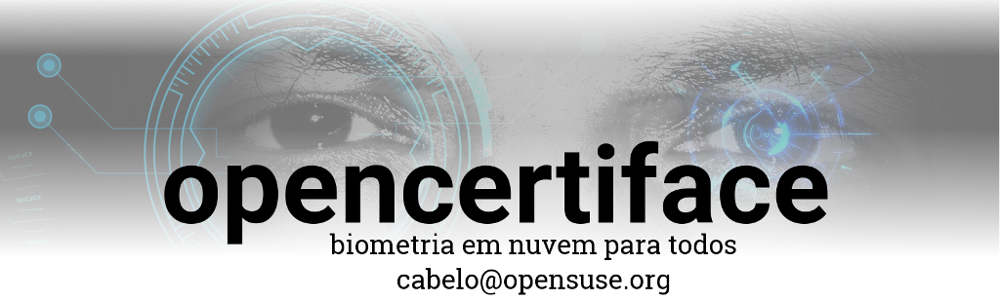
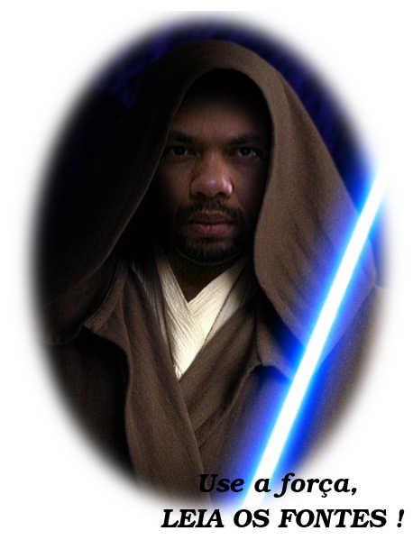

#

 O [openCertiface](http://opencertiface.com.br) baseado na nuvem [Microsoft Azure](https://azure.microsoft.com/pt-br/), [Google Cloud](https://cloud.google.com/) ou [AWS](https://aws.amazon.com/), é a versão de código aberto do serviço de biometria facial em nuvem [CERTIFACE](https://www.youtube.com/watch?v=iKmaT43kEqM). Esta iniciativa foi somente possível graças á visão diferenciada do projeto Certiface. Pois além de apoiar todo trabalho, carregam o espírito colaborativo, com isto trazendo para a empresa o objetivo de utilizar a tecnologia a serviço da sociedade. Sendo assim, agradeço em nome de toda comunidade de software livre por permitir esta contribuição criada para proteger as pessoas do bem.

Versao 1.1
* Update algoritmo biométrico

Versão 1.0

* Lançamento na [Campus Party 2016](http://campuse.ro/events/campus-party-brasil-2016/talk/biometria-opensource-focada-para-o-desenvolvedor/)
* Disponível serviço versão SOAP em C 
* Código cliente exemplo em C, Java, Bash e PHP
* Abstração do algoritmo openbr

RoadMap
* Implementar API para cálculo de estimativa de idade
* Implementar API para cálculo de estimativa de sexo
* Código exemplo em C#, perl e python
* Tutorial de instalação e utilização do opencertiface
* Criar biblioteca dinamica para abstrair algoritmo utilizado
* Melhorar o designer da pagina
* Criar imagem Linux 
* Criar pacotes rpm para Fedora, Red Hat, SUSE e openSUSE
* Web service RestFull
* Modulo do apache

O próximo grande salto evolutivo da humanidade será a descoberta de que cooperar é melhor que competir, pois colaborar atrai amigos competir atrai inimigos...

A todos os membros da comunidade de código aberto que levam a sério o ESPÍRITO HACKER e utilizam essa força para o bem, aos que defendem a "LIBERDADE DA INFORMAÇÃO", aos que me incentivaram desde 1998 em meus primeiros contatos com o Software Livre, aos que se sacrificam para divulgar informações, aos que amam os seus idealismos acima do capitalismo e que lutam para fazerem um mundo melhor sem prejudicar terceiros. A todos que defendem estes ideais, um **MUITO OBRIGADO** !

Autor: Alessandro de Oliveira Faria (A.K.A. Cabelo) contato: cabelo@opensuse.org

